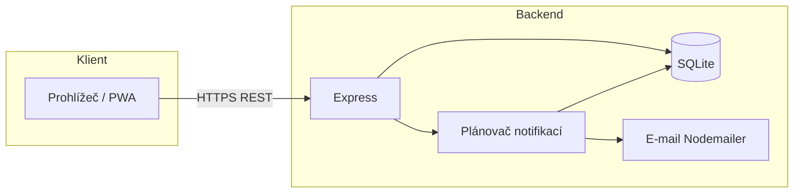

# Technická dokumentace – Popelnice

Dokument popisuje architekturu, komponenty, API a nasazení aplikace **Popelnice** – PWA pro připomínky svozu komunálního a BIO odpadu a obecních poplatků s e-mailovými notifikacemi.

---

## 1. Přehled systému

### 1.1 Účel aplikace

- Zobrazení **termínů svozu** (komunální odpad, BIO) a **obecních poplatků** v aktuálním měsíci.
- E-mailové **připomínky** den před svozem a den před začátkem platebního období poplatků.
- **PWA** – instalace na mobil (Android, iOS) z prohlížeče.

### 1.2 Architektura



- **Frontend:** statický HTML + CSS + JS, servírovaný buď z **Vercelu** (PWA) nebo z **Expressu** (Render).
- **Backend:** Node.js, Express, TypeScript. REST API, SQLite, plánovač notifikací, odesílání e-mailů (Gmail SMTP).

### 1.3 Technologický stack

| Vrstva   | Technologie |
|----------|-------------|
| Frontend | HTML5, CSS3, JavaScript (vanilla), PWA (manifest, Service Worker) |
| Backend  | Node.js 18+, Express 4.x, TypeScript 5.x |
| Databáze | SQLite (better-sqlite3) |
| E-mail   | Nodemailer (Gmail SMTP) |
| Bezpečnost | Helmet (CSP, X-Frame-Options, atd.), CORS |
| Hosting  | Render (celá aplikace) nebo Render + Vercel (split) |

---

## 2. Struktura projektu

```
Popelnice/
├── backend/                 # Node.js + TypeScript backend
│   ├── src/
│   │   ├── index.ts         # HTTP server, routy, statický frontend, helmet
│   │   ├── config.ts        # Načtení .env (PORT, timezone, Gmail)
│   │   ├── db.ts            # SQLite init, schéma tabulek
│   │   ├── models.ts        # Typy (User, Notification, FeePeriod, …)
│   │   ├── seedFees.ts      # Auto-seed fee_types + fee_periods při startu
│   │   ├── scheduler.ts     # planNotificationsFromData(), processDueNotifications()
│   │   ├── emailSender.ts   # Odeslání e-mailu přes Nodemailer
│   │   ├── recipientsValidation.ts
│   │   └── scripts/
│   │       ├── import-waste-2026.ts   # Import svozů do DB
│   │       └── seed-fees-2026.ts      # Ruční seed poplatků (volitelně)
│   ├── data/
│   │   └── svoz-2026.json   # Fallback kalendář svozů (bez DB)
│   ├── package.json
│   ├── tsconfig.json
│   └── .env.example
├── frontend/
│   ├── index.html           # Jediná stránka, všechny sekce + JS
│   ├── manifest.json        # PWA manifest (id, icons, display, …)
│   ├── sw.js                # Service Worker (cache-first, offline)
│   ├── config.js            # Generován buildem: window.API_BASE (Vercel)
│   ├── vercel.json          # Build, HTTP hlavičky (pouze Vercel)
│   ├── package.json         # build = generování config.js z API_BASE
│   └── icons/
│       ├── icon-192.png
│       └── icon-512.png
├── render.yaml              # Render: build & start pro backend, root = repo
├── README.md
└── TECHNICKA_DOKUMENTACE.md # Tento dokument
```

---

## 3. Databázové schéma (SQLite)

Soubor: `backend/src/db.ts`, soubor DB: `backend/popelnice.db` (vytvořen při startu).

| Tabulka | Popis |
|---------|--------|
| `users` | Jedna domácnost (singleton): id, email, name, address, created_at |
| `household_settings` | Nastavení domácnosti (objem nádoby, frekvence, poplatky) |
| `waste_pickup_events` | Kalendář svozů: municipality, date, type (komunal/bio), note |
| `fee_types` | Typy poplatků (název, sazba, jednotka, popis) |
| `fee_periods` | Období platby: fee_type_id, date_from, date_to, deadline_type, note |
| `notifications` | Naplánované/odeslané notifikace: user_id, type (svoz/poplatek), send_at, status, waste_pickup_id / fee_period_id |
| `notification_recipients` | Další e-mailoví příjemce (label, email) |

**Inicializace:**  
- `initDb()` vytvoří tabulky při startu serveru.  
- `seedFeesIfEmpty()` po startu naplní `fee_types` a `fee_periods` výchozími daty pro rok 2026, pokud jsou tabulky prázdné (např. čerstvý deploy na Renderu).

---

## 4. Backend API

Základ URL: podle nasazení (např. `https://popelnice.onrender.com` nebo lokálně `http://localhost:4000`).

### 4.1 Health a konfigurace

| Metoda | Endpoint | Popis |
|--------|----------|--------|
| GET | `/health` | Health check, odpověď `{ "status": "ok" }` |
| GET | `/api/email-check` | Diagnostika: zda je nastaven Gmail user a app password |
| GET | `/api/meta` | Údaje pro UI: `municipality`, `dataYear`, `lastUpdated` (YYYY-MM-DD), volitelně `footerLinks` (pole `{ label, href }`, může být prázdné). Hlavička zobrazí text `municipality - dataYear` bez odkazu. Hodnotu `lastUpdated` lze přepsat env `DATA_LAST_UPDATED`. |

### 4.2 Uživatel / domácnost

| Metoda | Endpoint | Popis |
|--------|----------|--------|
| GET | `/api/user` | Aktuální uživatel (singleton). 404 pokud neexistuje. |
| POST | `/api/user` | Vytvoření/aktualizace uživatele (email, name, address). Tělo: JSON. |

### 4.3 Další příjemci e-mailů

| Metoda | Endpoint | Popis |
|--------|----------|--------|
| GET | `/api/recipients` | Seznam dalších příjemců (id, email, label) |
| POST | `/api/recipients` | Přidání příjemce (email, label). Validace e-mailu a max. počet. |
| DELETE | `/api/recipients/:id` | Smazání příjemce podle id |

### 4.4 Svozy a kalendář

| Metoda | Endpoint | Popis |
|--------|----------|--------|
| GET | `/api/waste-events?year=YYYY` | Svozové události pro daný rok (`DISTINCT date, type`, bez duplicit). Pokud DB nemá data, fallback na `backend/data/svoz-2026.json`. |

### 4.5 Poplatky

| Metoda | Endpoint | Popis |
|--------|----------|--------|
| GET | `/api/current-fees` | **Probíhající poplatky** – čte přímo z `fee_periods` + `fee_types`. Podmínka: `date_from <= dnes` a `date_to >= dnes` (jen aktuální období). Odpověď: `{ fees: [{ id, name, description, rate, unit, dateFrom, dateTo, deadlineType, note, active }] }` (`active` je vždy `true`). |
| GET | `/api/next-notifications` | Naplánované notifikace (svoz + poplatek) z tabulky `notifications` – pro budoucí rozšíření UI. |

### 4.6 E-mail

| Metoda | Endpoint | Popis |
|--------|----------|--------|
| POST | `/api/send-test-email` | Odešle testovací e-mail na hlavní e-mail uživatele a všechny další příjemce. |

### 4.7 Statické soubory (pouze při servírování frontendu z Expressu)

| Metoda | Endpoint | Popis |
|--------|----------|--------|
| GET | `/manifest.json` | PWA manifest, hlavička `Content-Type: application/manifest+json` |
| GET | `/sw.js` | Service Worker, hlavička `Service-Worker-Allowed: /` |
| GET | `/*` | Ostatní statické soubory z `frontend/` (index.html, config.js, icons, …) |

---

## 5. Plánovač notifikací (scheduler)

Soubor: `backend/src/scheduler.ts`.

### 5.1 Požadavek projektu – povolené připomínky e-mailem

Záměr je mít **pouze tyto tři předměty** automatických připomínek (žádné jiné hlášky z plánovače neodcházejí):

1. `Připomínka: zítra svoz odpadu`
2. `Připomínka: zítra začíná období poplatků`
3. `Připomínka: zítra začíná období hlášení stavu vodoměru`

**Pravidla:**

- V **žádném případě** nesmí odejít **jiné** hlášky z automatického plánovače než výše uvedené tři – nastavení a parametry dat (`fee_periods.deadline_type`, plánování svozů) musí být v souladu s těmito položkami.
- Pokud **současně** nastane situace, kdy by šlo odeslat připomínku k **období hlášení stavu vodoměru** i k **obecnému období poplatků** (stejný den začátku `date_from`), musí odejít **pouze** hláška s předmětem **`Připomínka: zítra začíná období hlášení stavu vodoměru`** – připomínka „období poplatků“ pro ten den se **neodesílá** (vodoměr má přednost).

**Implementace:** konstanty `REMINDER_SUBJECT_WASTE`, `REMINDER_SUBJECT_POPLATKY`, `REMINDER_SUBJECT_VODOMER` a logika `processDueNotifications()` / `planNotificationsFromData()` v `backend/src/scheduler.ts`.

---

- **planNotificationsFromData()** – voláno jednorázově při startu serveru. Pro každý svoz v `waste_pickup_events` a pro každé `fee_periods` s `deadline_type` pouze `platba` nebo `nahlaseni_stavu` vytvoří záznam v `notifications` (den před svozem / den před `date_from`, odeslání v 18:00 v APP_TIMEZONE). Jiné typy poplatkových období se neplánují. Vyžaduje existenci uživatele (singleton) a nastavený `TEST_RECIPIENT_EMAIL` nebo e-mail uživatele.
- **processDueNotifications(now)** – voláno každou minutu z `index.ts`. V **18:00** (`APP_TIMEZONE`) odesílá výhradně e-maily s jedním z těchto předmětů:
  - `Připomínka: zítra svoz odpadu` – nejvýše **jednou** na příjemce za den, i když je zítra více svozů;
  - `Připomínka: zítra začíná období poplatků` – pro období s `deadline_type = platba`;
  - `Připomínka: zítra začíná období hlášení stavu vodoměru` – pro období s `deadline_type = nahlaseni_stavu`.
  Pokud stejný den (`date_from`) začíná vodoměr i platba, odejde **jen** připomínka vodoměru, ne obě. Stav řádků v `notifications` se nastaví na `odeslano` / `selhalo`.

Příjemci e-mailů: hlavní e-mail uživatele + všichni z `notification_recipients` (bez duplicit).

---

## 6. Frontend (PWA)

- **Jednostránková aplikace:** `frontend/index.html` obsahuje vše – styly, markup karet (Kdy co sveze?, Poplatky obce, Kalendář svozů). Správa dalších e-mailových příjemců není v UI; endpointy `/api/recipients` zůstávají pro správce (API / nástroje).
- **Konfigurace API:** `window.API_BASE` se nastavuje z `config.js`. Na Vercelu se generuje při buildi z env proměnné `API_BASE`. Na Renderu je `API_BASE` prázdný (stejný origin).
- **Poplatky:** Volá `GET /api/current-fees`, zobrazuje seznam probíhajících období s badge „AKTIVNÍ“, platební období a poznámku.
- **Svozy:** Volá `GET /api/waste-events?year=...`, zobrazuje nejbližší svozy a kalendář měsíce.
- **PWA:** `manifest.json` (id, name, short_name, icons s purpose any maskable, display standalone, theme_color, …). `sw.js` – cache-first pro statiku, network-only pro `/api/*`, offline fallback na index.html.

### 6.1 Bezpečnostní hlavičky

- **Vercel:** `frontend/vercel.json` – X-Content-Type-Options, X-Frame-Options, Referrer-Policy, Permissions-Policy, Content-Security-Policy (včetně connect-src na backend).
- **Render (Express):** `helmet` middleware v `backend/src/index.ts` (CSP, X-Frame-Options, atd.) + explicitní routy pro `manifest.json` a `sw.js` se správnými Content-Type a Service-Worker-Allowed, aby Chrome/Play Protect neblokoval instalaci WebAPK.

---

## 7. Konfigurace a proměnné prostředí

### 7.1 Backend (.env, Render Environment)

| Proměnná | Povinnost | Popis |
|----------|-----------|--------|
| `PORT` | Nepovinné | Port serveru (výchozí 4000). Render nastavuje sám. |
| `APP_TIMEZONE` | Nepovinné | Časová zóna pro plánování (výchozí Europe/Prague). |
| `GMAIL_USER` | Povinné pro e-mail | Gmail účet pro odesílání. |
| `GMAIL_APP_PASSWORD` | Povinné pro e-mail | App heslo z Google účtu (myaccount.google.com/apppasswords). |
| `TEST_RECIPIENT_EMAIL` | Doporučené | Fallback e-mail pro příjemce, pokud uživatel není založen. |
| `DATA_LAST_UPDATED` | Nepovinné | Datum `YYYY-MM-DD` zobrazené v aplikaci jako „naposledy aktualizováno“ (`/api/meta`). |
| `FRONTEND_ORIGIN` | Pouze při split deployi | Povolený CORS origin (např. https://popelnice.vercel.app). |

### 7.2 Frontend (Vercel)

| Proměnná | Popis |
|----------|--------|
| `API_BASE` | Plná URL backendu bez koncového lomítka (např. https://popelnice.onrender.com). Při buildi se zapíše do `config.js` jako `window.API_BASE`. |

---

## 8. Nasazení

### 8.1 Render (doporučené – jedna URL)

- Repozitář připojen k Renderu, root = celý repo.
- **Build:** `cd backend && npm install && npm run build`
- **Start:** `cd backend && node dist/index.js`
- V **Environment** nastavit: `GMAIL_USER`, `GMAIL_APP_PASSWORD`, `APP_TIMEZONE`, `TEST_RECIPIENT_EMAIL`.
- Aplikace včetně frontendu běží na přidělené URL (např. https://popelnice.onrender.com). PWA instalace z této URL má všechny hlavičky díky helmetu.

### 8.2 Vercel (frontend) + Render (backend)

- **Vercel:** Root Directory = `frontend`, build dle `vercel.json`, env `API_BASE` = URL Render backendu.
- **Render:** Root = `backend`, build/start jako výše, env `FRONTEND_ORIGIN` = URL Vercelu.
- V `vercel.json` v CSP upravit `connect-src` na skutečnou URL backendu.

### 8.3 Redeploy

- **Render:** Dashboard → služba popelnice → Manual Deploy → Deploy latest commit.
- **Vercel:** Dashboard → projekt → Deployments → Redeploy u posledního deploye.
- Při pushi na `main` obě platformy obvykle spustí automatický deploy.

---

## 9. Skripty a údržba dat

| Příkaz | Popis |
|--------|--------|
| `npm run dev` (v backend/) | Vývojový server s live reload. |
| `npm run build` (v backend/) | Překlad TypeScriptu do `dist/`. |
| `npm run import:waste-2026` | Import svozů z dat do `waste_pickup_events`. |
| `npm run seed:fees-2026` | Ruční vložení poplatků 2026 (jinak se použije auto-seed při startu). |

---

## 10. Verze dokumentu

- Datum: 2026
- Projekt: Popelnice (backend + frontend PWA)
- Popis odpovídá stavu po implementaci: auto-seed poplatků, endpoint `/api/current-fees`, helmet na Renderu, PWA manifest a safe-area pro iOS/Android, plánovač se třemi pevnými předměty e-mailů a prioritou vodoměru (§ 5.1).

---

## 11. Security & deployment checklist

- **ADMIN_TOKEN**  
  - V produkci nastav proměnnou prostředí `ADMIN_TOKEN` na dlouhý náhodný řetězec.  
  - Frontend při volání mutačních endpointů (`POST /api/user`, `POST /api/recipients`, `DELETE /api/recipients/:id`, `POST /api/send-test-email`) musí posílat HTTP hlavičku `X-Admin-Token: <ADMIN_TOKEN>`.  
  - Bez `ADMIN_TOKEN` jsou endpointy funkční, ale nechráněné (vhodné jen pro lokální vývoj).

- **CORS / FRONTEND_ORIGIN**
  - V produkci vždy nastav `FRONTEND_ORIGIN` na URL frontendu (např. `https://popelnice.vercel.app`).  
  - Backend pak přes CORS povolí jen tento origin.

- **Secrets**
  - `GMAIL_USER` a `GMAIL_APP_PASSWORD` nastav pouze jako secrets v Renderu / Vercelu, nikdy je necommituj do repozitáře.  
  - Lokálně používej `.env`, který zůstává mimo git.

- **HTTPS**
  - Veřejnou URL Popelnice publikuj pouze přes HTTPS (Render, případně vlastní doména s TLS).  
  - Neukládej žádné `http://` odkazy do `index.html`, manifestu ani do jiných statických souborů.

- **Health-check**
  - Endpoint `/health` používej jen jako prostý stav služby.  
  - Nekóduj do něj žádné citlivé informace ani debug výstupy.

- **Play Protect / Edge**
  - Instalaci PWA doporučuj primárně přes Chrome.  
  - Varování Edge typu „Nebezpečná aplikace byla zablokována“ je typicky reputační – ověř, že:  
  - používáš stabilní HTTPS URL,  
  - manifest a ikony odpovídají značce,  
  - aplikace nepožaduje přístup k citlivým oprávněním (kamera, mikrofon, geolokace, atd.).

---

## 12. Lessons learned (Render build & bezpečnost)

- **Validní `package.json` je kritický pro deploy**  
  - I malá syntaktická chyba (např. chybějící uvozovka nebo složená závorka u `devDependencies`) způsobí pád Render buildu už při `npm install` s hláškou `npm ERR! JSON.parse`.  
  - Před pushem je dobré spustit `npm run build` lokálně nebo alespoň otevřít `package.json` v editoru s JSON validací.

- **Security změny vždy ovlivní deploy**  
  - Přidání balíčků jako `helmet` nebo `express-rate-limit` musí být správně zapsané v `dependencies`.  
  - Po větších security úpravách (hlavičky, middleware) je vhodné udělat krátký smoke‑test lokálně (`npm run dev`, zkusit základní API endpointy) ještě před pushem.

- **Render logy jsou klíčové při ladění**  
  - Při chybě v e‑mailu od Renderu vždy kliknout na „Zobrazit záznamy“ a hledat první `npm ERR` / `node ERR`.  
  - Typickým vzorem je:  
    - `npm error JSON.parse Unexpected token ... in JSON at position ...` → problém v `package.json`.  
    - Nebo chyby při run scriptu (`npm run build`, `npm start`) – ty se řeší podle stack trace.

- **Bezpečnostní hlavičky a reputace PWA**  
  - Přísnější hlavičky přes `helmet` + CSP na Vercelu pomáhají tomu, aby Chrome / Play Protect viděl PWA jako „bezpečnou“ (žádná nečekaná povolení, žádný přístup k systému).  
  - Přesto může Edge ukazovat varování na základě reputace domény – to je potřeba brát jako reputační filtr, ne jako chybu v kódu.
